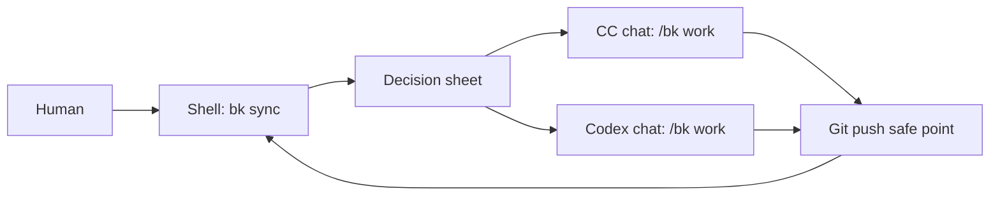
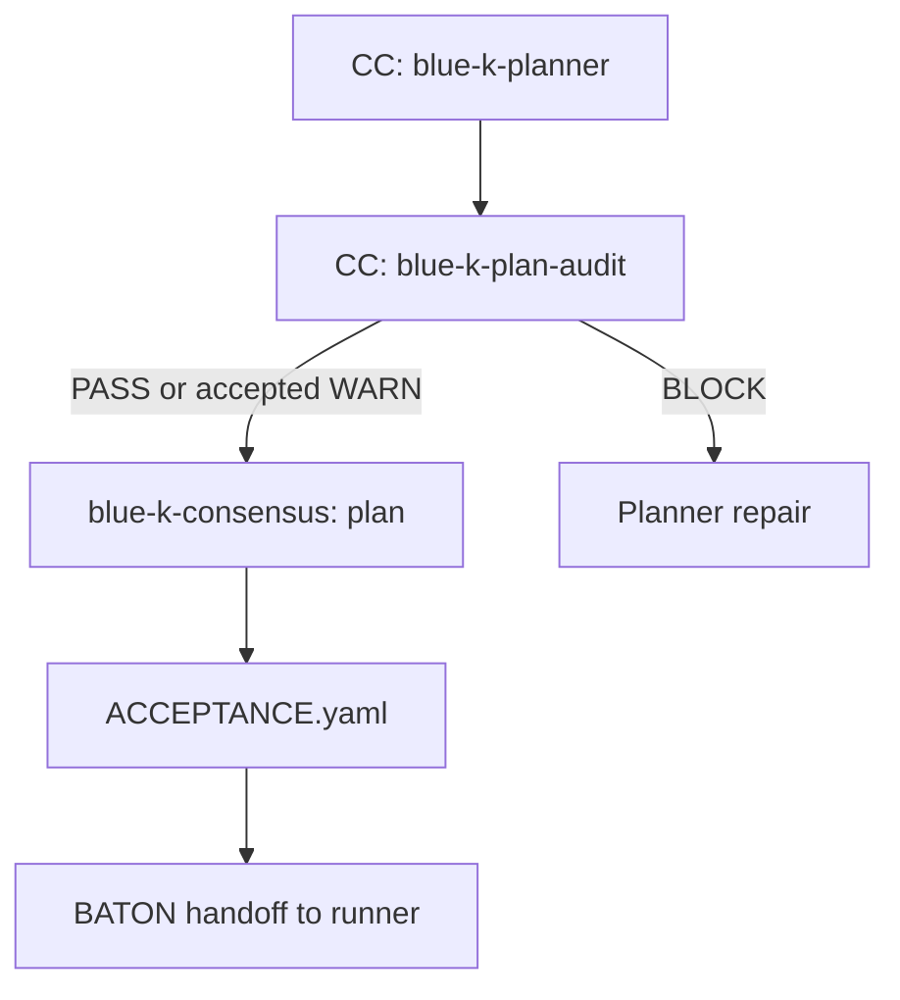
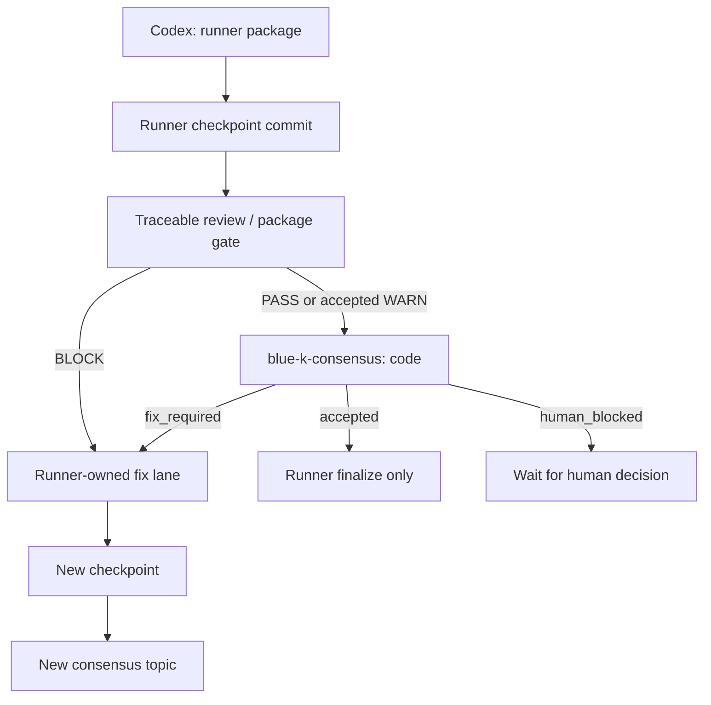

# Blue-K Git Baton Protocol v0.9

This is the current baseline for testing cross-machine CC + Codex work through
Git only. The real DND backend Blue-K skills remain the execution authority.
This testkit validates the wrapper decisions around them.

## Two Entries

```text
bk sync   - shell command; read-only remote inspection and decision sheet
/bk work  - AI chat command; executes exactly the assignment named by BATON
```

Shell `bk sync` must not execute planner, audit, runner, review, or consensus
skills. It prints the next safe command and the window where the human should
run it.

Shell `bk work` must not exist as a hidden executor. If a user tries it, print:

```text
Send /bk work in the CC or Codex chat window named by bk sync.
```

## Truth Sources

```text
blue-k/coordination  - control truth only
blue-k/<task>        - business truth only
```

`origin/blue-k/coordination:.blue-k/BATON.yaml` is the only control truth.
Work-branch copies of BATON are snapshots only and cannot authorize work.

The work branch is the business truth source: plans, progress, package docs,
runner checkpoints, evidence, consensus docs, acceptance docs, and simulated
source changes live there.

Ordinary `/bk work` requires:

```text
local HEAD == origin/<work-branch> == BATON.WorkBranchHead
working tree clean, including untracked non-ignored files
BK_ROLE == BATON.OwnerRole
no active competing lease
```

Unattended completion must push the work branch and coordination branch
atomically:

```text
git push --atomic origin <work-branch> blue-k/coordination
```

If the remote cannot guarantee atomic push, stop with
`ATOMIC_PUSH_UNAVAILABLE`.

## Ownership Boundaries

The wrapper may:

- fetch remote refs;
- read BATON, progress, audit, review, and consensus artifacts;
- acquire a coordination lease through compare-and-swap;
- call the correct Blue-K skill in the correct chat window;
- publish one final handoff after the underlying skill reaches a safe point.

The wrapper must not:

- select packages;
- write progress tables;
- run `stage-loop-auto`;
- run code graph package gates;
- create runner checkpoint commits;
- convert lower-gate `BLOCK` to `PASS`;
- merge, rebase, force push, or auto-takeover across machines.

`blue-k-main-runner` and `blue-k-other-runner` own package selection, resume,
fix lanes, progress-table writes, package gates, and checkpoint commits.

## Lane Map

```text
blue-k-planner       - CC suited
blue-k-plan-audit    - CC suited
blue-k-main-runner   - Codex suited
blue-k-other-runner  - Codex suited
blue-k-consensus     - mixed discussion/review lane; docs only
```

The consensus lane is stored under:

```text
docs/mian-k/_consensus/<topic-id>/
```

`docs/mian-k` is intentional in this testkit because the current Blue-K
materials use that existing directory name. Do not normalize it to
`docs/main-k` unless the upstream workflow is renamed.

It must contain `NOT_A_PACKAGE.md` and must be excluded from package discovery.
It must not contain package-shaped files such as `EXECUTE.md`.

## Execution Diagrams

### Control Shell And AI Window



### Plan Consensus



### Code Review Consensus



## Consensus Lane

Every plan output needs one comprehensive discussion/synthesis before runner
execution. Every code/package output needs one comprehensive review/synthesis
before runner finalization.

Consensus modes:

```text
light     - tiny role signals; allowed only for clean PASS code review cases
standard  - default for plan consensus
full      - required for WARN/BLOCK, scope drift, takeover, recovery, graph risk
```

Plan consensus default: `standard`.
Code consensus default: `light`.

Clean light code consensus may auto-accept only if all role signals are PASS,
all lower gates are PASS, no waiver/substitute opinion is used, and the
canonical acceptance hash matches exact commit blobs.

Consensus output must bind:

```yaml
TopicId:
Kind: plan | code
Mode: light | standard | full
Status: open | accepted | fix_required | human_blocked | superseded | cancelled
SubjectCommit:
WorkBranch:
LowerGateEvidence:
  - kind:
    commit:
    path:
    blob:
    verdict:
LiveOpinionsHash:
AcceptanceHash:
AutoAccepted: true | false
```

`LIVE_OPINIONS.yaml` and the closure marker are part of the canonical
`AcceptanceHash`.

## Lower Gate Precedence

Consensus is synthesis, not a bypass.

- `blue-k-plan-audit BLOCK` returns to planner repair.
- Traceable review / code graph / package gate `BLOCK` returns to runner fix.
- Human `accept_risk` may accept only lower-gate PASS or explicitly accepted
  WARN. It cannot override lower-gate BLOCK.
- Waiver means "allow missing substitute input"; it is not a PASS opinion.
- Waiver/substitute cases cannot use light auto-accept.

## Stale Topic Invalidation

Any action that creates a new `SubjectCommit` supersedes the previous consensus
topic for that subject.

Examples:

- plan revision;
- code fix;
- runner fix lane;
- takeover from last pushed checkpoint;
- dependency recovery fix;
- scope, package, or progress table change.

The old topic must be marked:

```yaml
Status: superseded
SupersededByTopicId:
SupersededBySubjectCommit:
Reason:
```

The next lane must reject an acceptance whose topic is `superseded` or
`cancelled`, or whose `SubjectCommit` differs from the current work head.

## Docs-Only Freeze

Between `SubjectCommit` and `AcceptanceCommit`, only files under the consensus
topic directory may change:

```text
docs/mian-k/_consensus/<topic-id>/**
```

If package docs, source files, progress tables, handoff files, or non-consensus
docs change during this interval, the topic is invalid. Create a new subject
commit and a new topic.

## Runner State Machine

```text
running -> review_pending
review_pending + accepted consensus -> runner finalize -> done
review_pending + fix_required -> runner fix lane -> new checkpoint -> review_pending
review_pending + human_blocked -> wait human decision
review_failed -> retry_fix | planner_repair | human_blocked
```

Runner finalization is its own assignment. It marks the current
`review_pending` row done and stops. It must not start the next package in the
same `/bk work` invocation.

## Dependency Recovery Fix Ownership

Other-runner consensus must bind dependency recovery decisions explicitly:

```yaml
SubjectPackage:
ActivePackage:
DependencyRecoveryTarget:
FixTarget: active_package | dependency_recovery_target | both
ProgressFile:
ProgressRowId:
FindingSetCommit:
```

The runner selector uses these fields to resume the correct fix lane. The
wrapper still must not preselect the package.

## Human-Blocked Decisions

Allowed human decisions:

```text
accept_risk
request_plan_revision
request_code_fix
approve_waiver
approve_takeover_from_last_pushed
cancel_topic
```

Rules:

- `accept_risk` cannot override lower-gate `BLOCK`.
- `request_plan_revision` routes to `blue-k-planner`.
- `request_code_fix` routes to the runner-owned fix lane.
- `approve_waiver` allows full consensus to continue; it is not PASS.
- `approve_takeover_from_last_pushed` resumes from remote checkpoint only.
- `cancel_topic` blocks the runner until a new instruction exists.

## Takeover

`LeaseExpiresAt` is a hint only. It does not authorize takeover.

Same-holder resume may use local dirty/unpushed state only by re-entering the
runner recovery gate.

Cross-side takeover can only resume from the last pushed work-branch checkpoint
and requires:

```text
/bk work --takeover --from-last-pushed --abandon-unpushed-ok
```

A matching `running` or `review_pending` row is a takeover target, not a
blocker. A competing different running lane/package is a blocker.

## Required `bk sync` Failure Fields

Blocked output must include:

```text
NEXT:
FailureCode:
Lane:
ProgressFile:
ProgressIndex:
ProgressStatus:
BatonState:
LeaseToken:
RemoteHead:
LastPushedCommit:
LastLocalCommit:
UnpushedCommits:
LocalDirty:
RemoteTakeoverAllowed:
TakeoverBasis:
Next command:
Log path:
```

Consensus-related output should also include:

```text
ConsensusKind:
ConsensusMode:
ConsensusStatus:
TopicStatus:
SubjectCommit:
AcceptanceSubjectCommit:
AutoAccepted:
FixTarget:
ActivePackage:
DependencyRecoveryTarget:
FindingSetCommit:
```
